# Yachts_devscout – QA Testing Report

This repository documents my Quality Assurance (QA) testing process, bug reports, and related assets for the **Yachts_devscout** web application.

## 🌐 Live Application
[http://yachtease.co](http://yachtease.co)

---

## 📌 Project Overview

**Yachts_devscout** is a yacht management and marketplace platform supporting five user roles:

- **Yachts** – Subscribe to plans, create jobs for suppliers/crew/freelancers, purchase products from suppliers, message other users, manage yacht profiles, and view order history.
- **Suppliers** – Add products with pricing, apply for yacht jobs, manage subscriptions, view order history, and process payments via Stripe.
- **Crew** – Maintain a profile, apply for jobs, and communicate with other users.
- **Freelancers** – Maintain a profile, apply for jobs, and communicate with other users.
- **Super Admin** – Manage the platform, oversee all user accounts, handle subscriptions, and ensure operational integrity.

Each role features secure authentication, verification, and dedicated dashboards.

---

## 🛠 QA Scope & Approach

My testing covered:

- **Functional Testing** – Verified all role-based features including subscriptions, job postings, messaging, product purchasing, and payment processing.
- **UI/UX Testing** – Checked for responsive design, navigation clarity, and alignment with Figma designs.
- **Cross-Browser Testing** – Validated consistent performance across major browsers.
- **Client Documentation Review** – Matched testing against business requirements and acceptance criteria.
- **Bug Reporting & Collaboration** – Logged issues in detail, coordinated with the dev team, and validated fixes.
- **Verification Testing** – Re-tested resolved issues to confirm fixes before deployment.

---

## 📂 Assets & Resources

- **Figma UI/UX Design:** [View Design](https://www.figma.com/design/vKD7oElVzsoBMU2YMVyOcB/robynatfloat_devscout?node-id=1-2&p=f&t=JxtcD8oB12HFWQPN-0)  
- **Google Sheets – Bug Report:** [View Bug Report](https://docs.google.com/spreadsheets/d/1ztXj8Xlh9Vr9GQEqrLbDP9pWz9JtvmUyASoncDDTYqQ/edit?usp=sharing)

---

## 📸 Screenshots

  
Click to expand screenshots

  

    
⬅️ Scroll horizontally to view all screenshots ➡️

    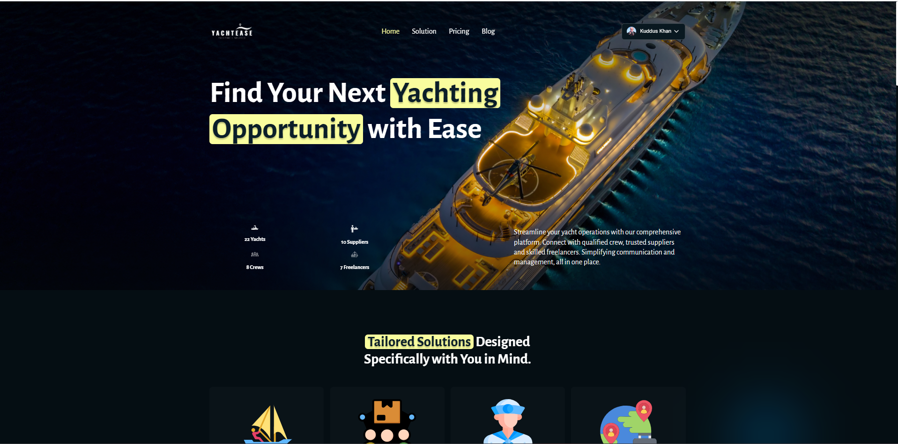
    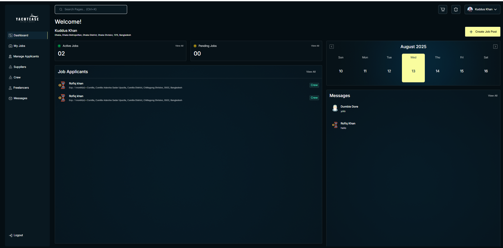
    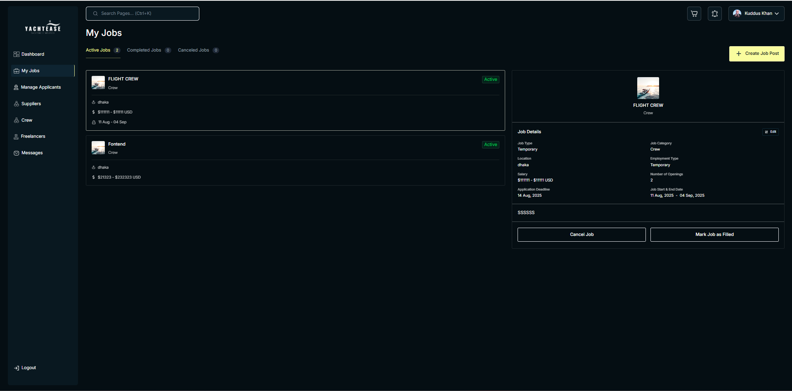
    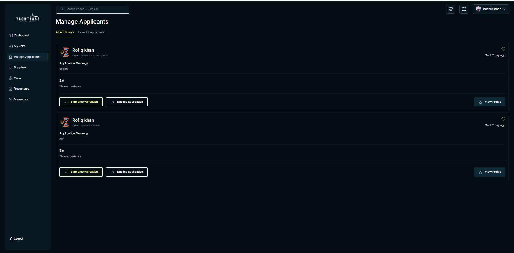
    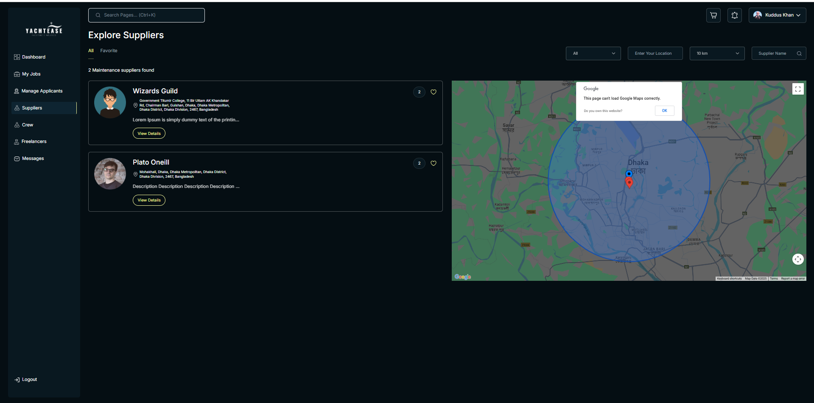
    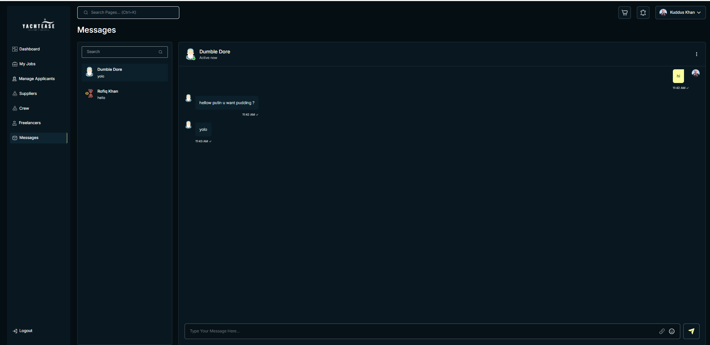
    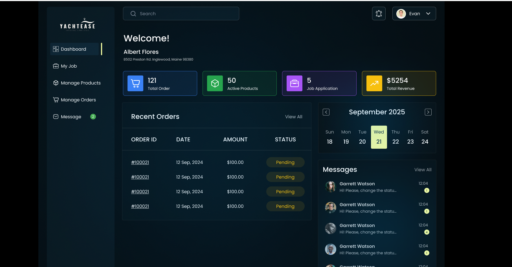
    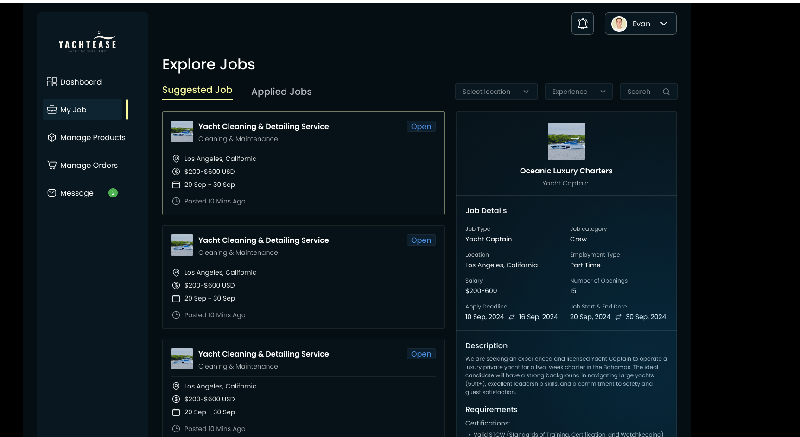
    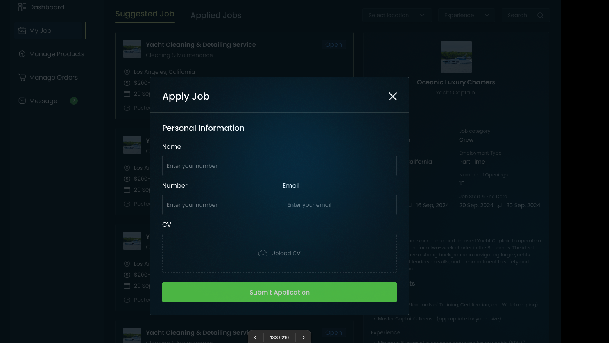
    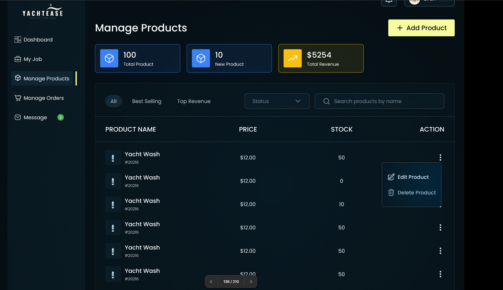
    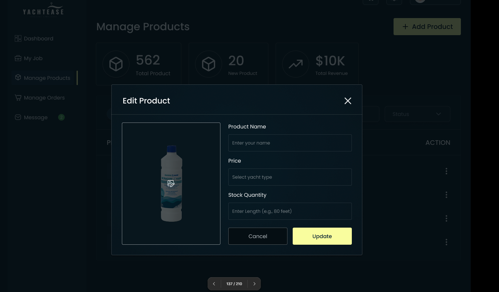
    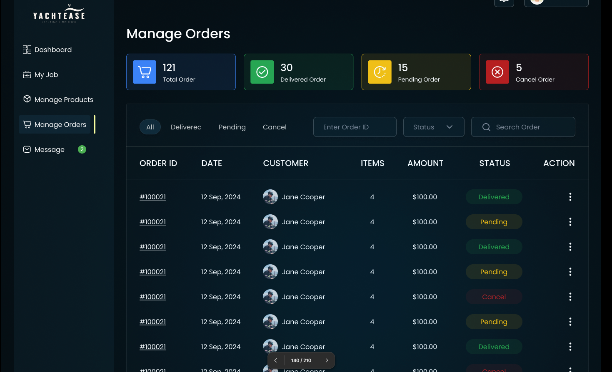
    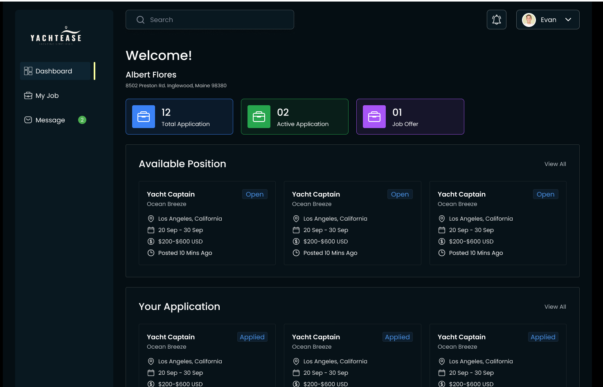
  

---

## ✅ Testing Deliverables

- End-to-end functional testing for all user roles.
- Detailed bug reports with severity ratings and reproduction steps.
- Stripe payment flow validation.
- Verified role-based access control and data integrity.
- Conducted UI/UX compliance checks against Figma design.
- Final sign-off after meeting client satisfaction.

---

## 🧑‍💻 QA Engineer

**Name:** MST Khushi Akter  
**Role:** QA Engineer – Functional, UI/UX, and Usability Testing  
**Tools & Platforms:** Browser DevTools, Google Sheets, Figma, Stripe Sandbox, Manual Testing Techniques.

---
